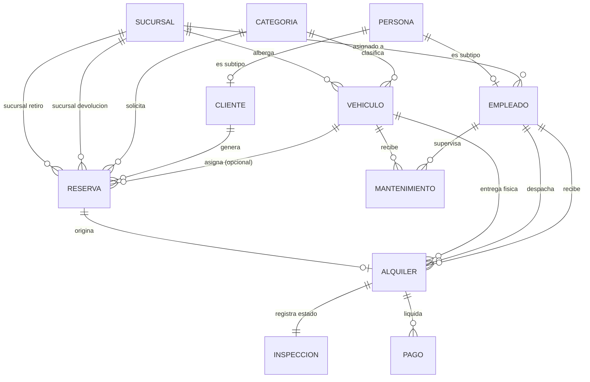
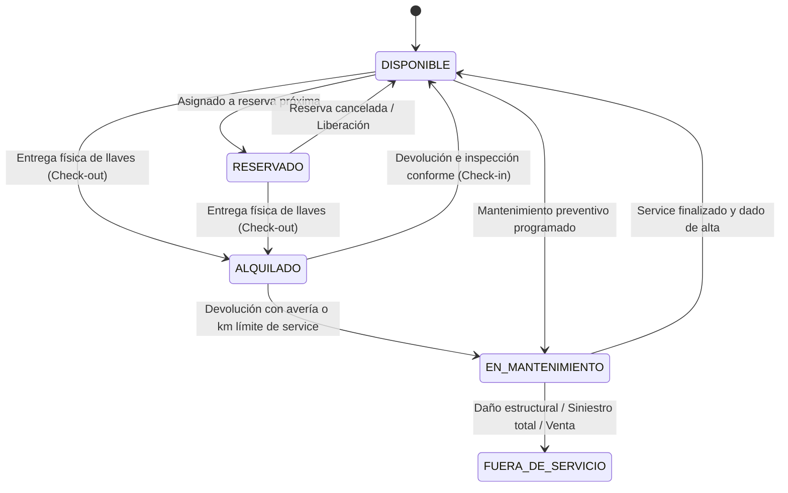
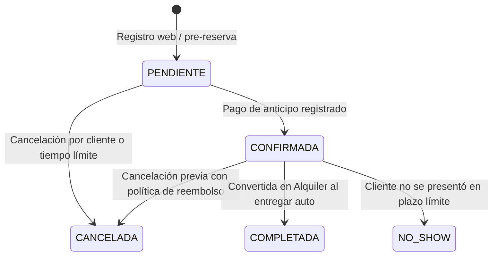
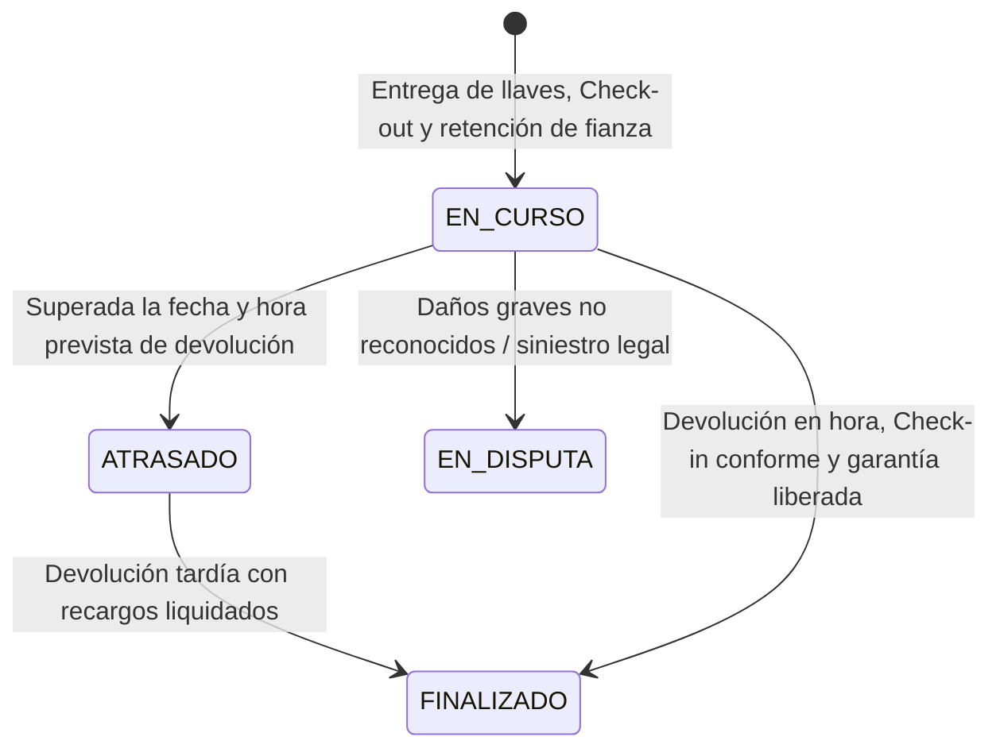

# OpenRental

**OpenRental** es una plataforma y modelo de base de datos para la gestión integral de alquiler de vehículos (*Rent-a-Car*). El sistema cubre desde la reserva en línea y control de disponibilidad de flota, hasta el despacho físico (*Check-out*), inspección de retorno con control de kilometraje y combustible (*Check-in*), depósitos en garantía, facturación y mantenimiento de vehículos.

---

## 1. Convenciones Generales y Principios de Diseño

1. **Claves Primarias y Subtipos**:
   - Toda entidad independiente utiliza `id_<entidad>` como clave primaria entera autoincremental.
   - La generalización `PERSONA` utiliza **herencia de tablas (supertipo/subtipo)**: `CLIENTE` y `EMPLEADO` comparten `id_persona` como PK y FK simultáneamente (relación 1:0..1). Esto evita la duplicidad de datos de contacto cuando un empleado actúa también como cliente.
2. **Identificación Internacional**:
   - Para soportar clientes nacionales y turistas extranjeros, no se fija un DNI rígido; se utiliza una combinación de `tipo_documento` (DNI, Pasaporte, Carnet de Extranjería) y `nro_documento`.
3. **Borrado Lógico (*Soft Delete*)**:
   - `PERSONA`, `VEHICULO` y `SUCURSAL` implementan borrado lógico mediante la bandera booleana `activo` para preservar la trazabilidad contractual y contable histórica.
4. **Congelamiento de Tarifas (*Price Snapshot*)**:
   - Los precios y tarifas maestras en `CATEGORIA` o `VEHICULO` pueden fluctuar en el tiempo. Por tanto, `RESERVA` y `ALQUILER` congelan las tarifas diarias pactadas (`tarifa_diaria_pactada`) al momento de la firma para evitar recálculos erróneos en alquileres históricos.
5. **Máquinas de Estado Estrictas**:
   - Los atributos `estado` en `VEHICULO`, `RESERVA`, `ALQUILER` y `PAGO` reflejan el ciclo de vida del proceso de negocio y están controlados mediante triggers y restricciones de base de datos.
6. **Precisión Temporal**:
   - Todas las operaciones de reserva y alquiler se manejan con `datetime` para permitir el cálculo exacto de períodos de 24 horas y cargos por horas de gracia/tardanza.

---

## 2. Diagrama Entidad-Relación (DER)

---

## 3. Entidades, Atributos y Reglas de Dominio

### Módulo A: Sedes, Personas y Roles

#### 3.1 SUCURSAL
Gestiona las sedes de la empresa (aeropuerto, terminal, centro financiero), permitiendo retiros y devoluciones en diferentes locales (*One-Way Rentals*).

| Atributo | Tipo | Regla de dominio |
|---|---|---|
| `id_sucursal` | int, PK | Autoincremental |
| `nombre` | varchar(50) | Único (Ej.: "Aeropuerto Jorge Chávez", "Miraflores Centro") |
| `ciudad` | varchar(50) | Obligatorio |
| `direccion` | varchar(150) | Obligatorio |
| `telefono` | varchar(20) | Opcional |
| `activo` | boolean | Default `true`; borrado lógico |

#### 3.2 PERSONA (Supertipo)
Concentra los datos comunes a cualquier persona registrada en el sistema.

| Atributo | Tipo | Regla de dominio |
|---|---|---|
| `id_persona` | int, PK | Autoincremental |
| `tipo_documento` | enum | `'DNI', 'PASAPORTE', 'CARNET_EXTRANJERIA'` |
| `nro_documento` | varchar(20) | Obligatorio; clave única compuesta con `tipo_documento` |
| `nombres` | varchar(60) | Obligatorio |
| `apellidos` | varchar(60) | Obligatorio |
| `telefono` | varchar(20) | Obligatorio; requerido para contacto durante la renta |
| `email` | varchar(100) | Obligatorio, único, validación de formato de correo |
| `activo` | boolean | Default `true`; borrado lógico |

#### 3.3 CLIENTE (Subtipo)
Agrega los requisitos legales indispensables para conducir y contratar el servicio de alquiler.

| Atributo | Tipo | Regla de dominio |
|---|---|---|
| `id_persona` | int, PK, FK → PERSONA | Comparte clave 1:1 con `PERSONA` |
| `nro_licencia` | varchar(20) | Obligatorio, único |
| `licencia_vencimiento` | date | Obligatorio; debe ser mayor a la fecha actual para autorizar contratos |
| `pais_licencia` | varchar(50) | País emisor de la licencia de conducir |
| `direccion` | varchar(150) | Domicilio habitual |
| `fecha_registro` | timestamp | Default `CURRENT_TIMESTAMP` |

#### 3.4 EMPLEADO (Subtipo)
Representa al personal operativo y administrativo que interviene en despachos, recepciones y mantenimiento.

| Atributo | Tipo | Regla de dominio |
|---|---|---|
| `id_persona` | int, PK, FK → PERSONA | Comparte clave 1:1 con `PERSONA` |
| `id_sucursal` | int, FK → SUCURSAL | Sucursal base a la que está asignado |
| `cargo` | enum | `'RECEPCIONISTA', 'MECANICO', 'ADMINISTRADOR', 'SUPERVISOR'` |
| `usuario` | varchar(30) | Único, para autenticación |
| `password_hash` | varchar(255) | Hash seguro (Argon2 / BCrypt); nunca en texto plano |

---

### Módulo B: Categorías y Flota de Vehículos

#### 3.5 CATEGORIA
Segmenta la flota por características y define la tarifa y garantía estándar de referencia.

| Atributo | Tipo | Regla de dominio |
|---|---|---|
| `id_categoria` | int, PK | Autoincremental |
| `nombre` | varchar(40) | Único (Ej.: "Económico Compacto", "Sedán Intermedio", "SUV Familiar", "Pickup 4x4") |
| `descripcion` | text | Detalle de gama y comodidades |
| `tarifa_base_diaria` | decimal(10,2) | > 0; precio por día de referencia |
| `monto_garantia_base`| decimal(10,2) | > 0; depósito en garantía / fianza requerida |

#### 3.6 VEHICULO
Representa cada unidad física de la flota con su estado operativo y ficha técnica.

| Atributo | Tipo | Regla de dominio |
|---|---|---|
| `id_vehiculo` | int, PK | Autoincremental |
| `placa` | varchar(10) | Único, sin espacios |
| `id_categoria` | int, FK → CATEGORIA | Obligatorio |
| `id_sucursal_actual`| int, FK → SUCURSAL | Sucursal donde se encuentra físicamente el vehículo |
| `marca` | varchar(30) | Obligatorio |
| `modelo` | varchar(30) | Obligatorio |
| `anio` | smallint | Entre 2010 y año actual + 1 |
| `color` | varchar(20) | Obligatorio |
| `transmision` | enum | `'MECANICA', 'AUTOMATICA'` |
| `combustible` | enum | `'GASOLINA', 'DIESEL', 'HIBRIDO', 'ELECTRICO', 'GLP'` |
| `capacidad_pasajeros`| smallint | Rango 2 a 9 |
| `kilometraje_actual` | int | ≥ 0; actualizado automáticamente tras cada alquiler o mantenimiento |
| `tarifa_diaria` | decimal(10,2) | Si es nula, toma por defecto `tarifa_base_diaria` de la categoría |
| `estado` | enum | `'DISPONIBLE', 'RESERVADO', 'ALQUILADO', 'EN_MANTENIMIENTO', 'FUERA_DE_SERVICIO'` |
| `activo` | boolean | Default `true`; borrado lógico |

---

### Módulo C: Reservas, Alquileres e Inspección

#### 3.7 RESERVA
Registra la intención o contrato previo de alquiler. Soporta reserva por categoría de vehículo (con asignación tardía de placa) para máxima flexibilidad operativa de flota.

| Atributo | Tipo | Regla de dominio |
|---|---|---|
| `id_reserva` | int, PK | Autoincremental |
| `codigo_reserva` | varchar(12) | Único; código alfanumérico amigable (Ej.: `RES-78921`) |
| `id_cliente` | int, FK → CLIENTE | Obligatorio |
| `id_categoria` | int, FK → CATEGORIA | Obligatorio; garantiza la gama solicitada |
| `id_vehiculo` | int, FK → VEHICULO, Nullable | Opcional al crear la reserva; se confirma antes de la entrega física |
| `id_sucursal_retiro`| int, FK → SUCURSAL | Sede de recogida |
| `id_sucursal_devolucion`| int, FK → SUCURSAL | Sede pactada de retorno |
| `fecha_inicio` | datetime | Fecha y hora pactada para el retiro |
| `fecha_fin` | datetime | `fecha_fin > fecha_inicio` |
| `tarifa_diaria_pactada`| decimal(10,2)| Precio diario congelado al momento de reservar |
| `total_estimado` | decimal(10,2) | Estimación de costo según días y horas calculadas |
| `estado` | enum | `'PENDIENTE', 'CONFIRMADA', 'CANCELADA', 'NO_SHOW', 'COMPLETADA'` |

#### 3.8 ALQUILER
Contrato legal de tenencia física del vehículo en ejecución. Todo alquiler se origina a partir de una reserva previa (aun para clientes que llegan en ventanilla o *walk-in*, se genera una reserva inmediata).

| Atributo | Tipo | Regla de dominio |
|---|---|---|
| `id_alquiler` | int, PK | Autoincremental |
| `nro_contrato` | varchar(20) | Único, foliado legal de contrato |
| `id_reserva` | int, FK → RESERVA, Único | Relación 1:1 con la reserva que le dio origen |
| `id_vehiculo` | int, FK → VEHICULO | Vehículo entregado físicamente |
| `id_empleado_entrega`| int, FK → EMPLEADO | Empleado responsable del despacho |
| `id_empleado_devolucion`| int, FK → EMPLEADO, Nullable | Empleado que recibe el vehículo (nulo al iniciar) |
| `fecha_entrega` | datetime | Fecha y hora real de entrega de llaves |
| `fecha_dev_prevista`| datetime | `fecha_dev_prevista >= fecha_entrega` |
| `fecha_dev_real` | datetime, Nullable | Fecha y hora real de devolución de llaves |
| `tarifa_diaria_aplicada`| decimal(10,2) | Tarifa diaria congelada para el contrato |
| `costo_total_final` | decimal(10,2), Nullable | Total liquidado al devolver (días reales + extras - cargos) |
| `estado` | enum | `'EN_CURSO', 'FINALIZADO', 'ATRASADO', 'EN_DISPUTA'` |

#### 3.9 INSPECCION (Check-out / Check-in)
Acta de inspección técnica obligatoria para salvaguardar el estado del activo y formalizar el deslinde de responsabilidades por combustible, kilometraje y daños.

| Atributo | Tipo | Regla de dominio |
|---|---|---|
| `id_inspeccion` | int, PK | Autoincremental |
| `id_alquiler` | int, FK → ALQUILER, Único | 1:1 con el contrato de alquiler |
| `km_salida` | int | Lectura del odómetro al entregar |
| `km_retorno` | int, Nullable | Lectura del odómetro al recibir (`km_retorno >= km_salida`) |
| `combustible_salida` | enum | `'VACIO', '1/4', '1/2', '3/4', 'LLENO'` |
| `combustible_retorno`| enum, Nullable | Nivel de combustible al momento de la devolución |
| `danos_salida` | text | Detalle de daños o rayones preexistentes (opcional) |
| `danos_retorno` | text, Nullable | Detalle de nuevos daños detectados durante la recepción |
| `cargos_adicionales` | decimal(10,2) | Costos por faltante de combustible, limpieza extrema o daños; default `0.00` |

---

### Módulo D: Pagos, Garantías y Mantenimiento

#### 3.10 PAGO
Gestiona todos los flujos de caja asociados a la renta: anticipos de reserva, saldo de alquiler, retención de depósito en garantía (fianza) y devoluciones.

| Atributo | Tipo | Regla de dominio |
|---|---|---|
| `id_pago` | int, PK | Autoincremental |
| `id_alquiler` | int, FK → ALQUILER | Alquiler asociado |
| `tipo_transaccion` | enum | `'ANTICIPO', 'PAGO_ALQUILER', 'DEPOSITO_GARANTIA', 'DEVOLUCION_GARANTIA', 'PENALIDAD'` |
| `monto` | decimal(10,2) | > 0 |
| `metodo_pago` | enum | `'EFECTIVO', 'TARJETA_CREDITO', 'TARJETA_DEBITO', 'TRANSFERENCIA'` |
| `referencia_operacion`| varchar(50) | Nro. de voucher POS, autorización bancaria o transferencia |
| `fecha_pago` | datetime | Default `CURRENT_TIMESTAMP` |
| `estado` | enum | `'APROBADO', 'PENDIENTE', 'RECHAZADO', 'REEMBOLSADO'` |

#### 3.11 MANTENIMIENTO
Controla las intervenciones técnicas, servicios preventivos periódicos y reparaciones por siniestros.

| Atributo | Tipo | Regla de dominio |
|---|---|---|
| `id_mantenimiento` | int, PK | Autoincremental |
| `id_vehiculo` | int, FK → VEHICULO | Obligatorio |
| `id_empleado` | int, FK → EMPLEADO | Responsable de la orden de servicio |
| `taller` | varchar(80) | Nombre del taller interno o proveedor externo |
| `tipo` | enum | `'PREVENTIVO', 'CORRECTIVO', 'INSPECCION_TECNICA'` |
| `descripcion` | text | Detalle del trabajo (ej.: cambio de aceite, frenos, alineación) |
| `km_al_servicio` | int | Kilometraje registrado al ingresar al taller |
| `costo` | decimal(10,2) | ≥ 0 |
| `fecha_inicio` | date | Fecha de ingreso al taller |
| `fecha_fin` | date, Nullable | Fecha de alta y reincorporación a la flota |
| `estado` | enum | `'PROGRAMADO', 'EN_TALLER', 'COMPLETADO'` |

---

## 4. Tabla de Cardinalidades y Participación

| Relación | Cardinalidad | Participación | Justificación |
|---|---|---|---|
| **Persona — Cliente** | 1:0..1 | Persona parcial, Cliente total | Una persona puede ser solo cliente, solo empleado, ambos o ninguno. |
| **Persona — Empleado** | 1:0..1 | Persona parcial, Empleado total | Comparte supertipo evitando duplicar DNI/contacto. |
| **Sucursal — Vehículo** | 1:N | Sucursal parcial, Vehículo total | Todo vehículo pertenece a una sucursal base/actual. |
| **Sucursal — Reserva (Retiro)** | 1:N | Sucursal parcial, Reserva total | Toda reserva define una sede de recogida. |
| **Sucursal — Reserva (Devolución)** | 1:N | Sucursal parcial, Reserva total | Permite devolver en una sede distinta a la de retiro. |
| **Categoría — Vehículo** | 1:N | Categoría parcial, Vehículo total | Todo vehículo pertenece obligatoriamente a una categoría. |
| **Categoría — Reserva** | 1:N | Categoría parcial, Reserva total | El cliente reserva por categoría garantizada. |
| **Cliente — Reserva** | 1:N | Cliente parcial, Reserva total | Un cliente puede acumular múltiples reservas históricas. |
| **Vehículo — Reserva** | 1:0..N | Vehículo parcial, Reserva parcial | El vehículo es opcional al inicio; se asigna antes de despachar. |
| **Reserva — Alquiler** | 1:0..1 | Reserva parcial, Alquiler total | Todo contrato de alquiler proviene de una reserva. |
| **Vehículo — Alquiler** | 1:N | Vehículo parcial, Alquiler total | Un vehículo acumula el historial de contratos en los que se alquiló. |
| **Empleado — Alquiler (Entrega)** | 1:N | Empleado parcial, Alquiler total | El empleado que entrega el auto queda registrado. |
| **Empleado — Alquiler (Devolución)**| 1:N | Empleado parcial, Alquiler parcial | El empleado que recibe puede diferir del de entrega. |
| **Alquiler — Inspección** | 1:1 | Alquiler total, Inspección total | Todo alquiler cuenta con su acta de Check-out / Check-in. |
| **Alquiler — Pago** | 1:N | Alquiler total, Pago total | Soporta anticipo, garantía, liquidación y penalidades separadas. |
| **Vehículo — Mantenimiento** | 1:N | Vehículo parcial, Mantenimiento total | Historial mecánico por unidad. |
| **Empleado — Mantenimiento** | 1:N | Empleado parcial, Mantenimiento total | Registro del supervisor del servicio. |

---

## 5. Ciclos de Vida y Máquinas de Estados

### 5.1 Ciclo de Vida del Vehículo
Controla la disponibilidad del activo para prevenir dobles reservas y coordinar el mantenimiento.

### 5.2 Ciclo de Vida de la Reserva

### 5.3 Ciclo de Vida del Alquiler (Contrato)

---

## 6. Reglas de Negocio para Implementación en Base de Datos 

1. **Prevención de Solapamiento (*Anti Double-Booking*)**:
   - Un trigger debe verificar que un mismo `id_vehiculo` no pueda tener dos reservas `CONFIRMADA` ni un `ALQUILER` en curso dentro del mismo intervalo `[fecha_inicio, fecha_fin]`.
2. **Actualización Automática de Odómetro**:
   - Al actualizar `km_retorno` en `INSPECCION`, un trigger debe actualizar automáticamente `VEHICULO.kilometraje_actual = km_retorno`.
3. **Consistencia de Kilometraje**:
   - Restricción `CHECK (km_retorno >= km_salida)`.
4. **Validación de Licencia Vigente**:
   - No se puede crear un `ALQUILER` si la `CLIENTE.licencia_vencimiento < ALQUILER.fecha_dev_prevista`.
5. **Cierre y Liquidación de Depósito**:
   - El estado de `ALQUILER` no puede transicionar a `'FINALIZADO'` sin haber registrado la transacción de devolución o aplicación de la garantía en `PAGO`.
6. **Sincronización de Estados de Vehículo**:
   - Al insertar un `ALQUILER`, el vehículo pasa automáticamente a `'ALQUILADO'`.
   - Al cerrar la inspección de retorno, si no hay daños pasa a `'DISPONIBLE'`; si se reportan daños, pasa a `'EN_MANTENIMIENTO'`.
